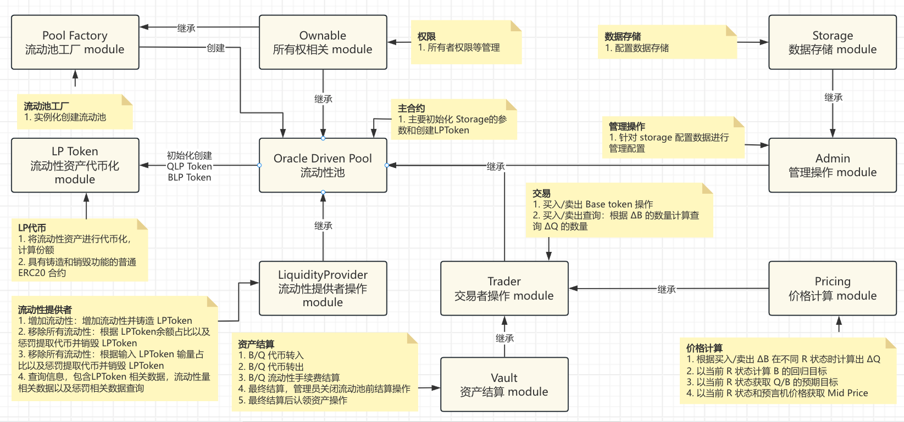

# Haedal Oracle Driven Pool

**DODO:**



## SUI PMM参数建议配置

### SUI V1 Pair SUI-USDC

预言机: Pyth

| 参数 | 说明 | 默认值 |
| :--- | :--- | :--- |
| `lpFeeRate` | LP 手续费率，`0.45%` / `0.0045` |  `4500000` |
| `mtFeeRate` | 维护者手续费率, `0.05%` / `0.0005` | `500000` |
| `k` | k 滑点，`0.01` / `1%`, 是否过大了 | `10000000` |
| `gasPriceLimit` | Gas价格限制, 无该配置 | - |

## DOOD 参数配置参考

### BSC V1 Pair [USDT-BUSD](https://bscscan.com/address/0x6064DBD0fF10BFeD5a797807042e9f63F18Cfe10#readContract)

预言机: 自己搭建？合约名: OffsetOracle

| 参数 | 说明 | 默认值 |
| :--- | :--- | :--- |
| `lpFeeRate` | LP 手续费率，`0%` | `0` |
| `mtFeeRate` | 维护者手续费率, `0.001%` | `10000000000000` |
| `k` | k 滑点，`0.02%` | `200000000000000` |
| `gasPriceLimit` | Gas价格限制,暂时无用 | `100000000000000000000000000000000000000` |

### ARB V1 Pair [WETH-USDC](https://arbiscan.io/address/0xFE176A2b1e1F67250d2903B8d25f56C0DaBcd6b2#readContract)

预言机: ChainlinkWETHUSDCPriceOracleProxy

| 参数 | 说明 | 默认值 |
| :--- | :--- | :--- |
| `lpFeeRate` | LP 手续费率，`0.375%` / `0.00375` |  `3750000000000000` |
| `mtFeeRate` | 维护者手续费率, `0.125%` / `0.00125` | `1250000000000000` |
| `k` | k 滑点，`0.1` / `10%`, 是否过大了 | `100000000000000000` |
| `gasPriceLimit` | Gas价格限制, `0.0001 ETH` | `100000000000000` |

------

## 结构体说明

    - Pool<phantom CoinTypeBase, phantom CoinTypeQuote> - 流动性池，用于存储流动性池相关信息
    - AdminCap - 合约管理权限，用于创建流动性池，控制合约版本，停止/销毁流动性池操作
    - PoolAdminCap<phantom CoinTypeBase, phantom CoinTypeQuote> - 流动性池管理权限，用于管理流动性池相关配置
    - LiquidityOperatorCap<phantom CoinTypeBase, phantom CoinTypeQuote> - 流动性操作权限，用于执行添加流动性操作（拥有 LPCoin就可以移出，不需要权限）

## API 说明

### OracleDrivenPool

#### QueryExpectedTargetByOracle - 根据预言机获取ExpectedTarget

**Module:** `oracle_driven_pool`

**Function:** `get_expected_target_by_oracle`

| 参数 | 说明 | 例如 |
| :--- | :--- | :--- |
| `base_coin_type` | Base Coin Type, 基础代币的 coinType |  `0x2::sui::SUI` |
| `quote_coin_type` | Quote Coin Type, 基础代币的 coinType | `0x2::sui::SUI` |
| `pool_id` | 流动池的 object id | `0x...` |
| `clock_id` | 区块时间 Object | `0x6` |
| `base_usd_price_info_obj_id` | Pyth 基础代币/USD 价格信息的 ObjectID (base_price_pair_obj) | `0x...` |
| `quote_usd_price_info_obj_id` | Pyth 计价代币/USD 价格信息的 ObjectID (quote_price_pair_obj) | `0x...` |

**返回值:**

| 参数 | 说明 | 例如 |
| :--- | :--- | :--- |
| `arg_idx_0` | base expected target |  `1000000` |
| `arg_idx_1` | quote expected target | `2000000` |

    ```move
    public fun get_expected_target_by_oracle<CoinTypeBase, CoinTypeQuote>(
        pool: &Pool<CoinTypeBase, CoinTypeQuote>, 
        clock: &Clock, 
        base_price_pair_obj: &PriceInfoObject, 
        quote_price_pair_obj: &PriceInfoObject, 
    ): (u64, u64)
    ```

### LiquidityProvider - 流动性提供者

#### QueryWithdrawBaseCoin - 根据 LPBaseCoin 查询能提取多少BaseCoin（基础代币）

**Module:** `liquidity_provider`

**Function:** `query_withdraw_base_coin`

| 参数 | 说明 | 例如 |
| :--- | :--- | :--- |
| `base_coin_type` | Base Coin Type, 基础代币的 coinType |  `0x2::sui::SUI` |
| `quote_coin_type` | Quote Coin Type, 基础代币的 coinType | `0x2::sui::SUI` |
| `liquidity_operator_cap_id` | 流动性操作者权限 Cap | `0x...` |
| `pool_id` | 流动池的 object id | `0x...` |
| `clock_id` | 区块时间 Object | `0x6` |
| `base_usd_price_info_obj_id` | Pyth 基础代币/USD 价格信息的 ObjectID | `0x...` |
| `quote_usd_price_info_obj_id` | Pyth 计价代币/USD 价格信息的 ObjectID | `0x...` |
| `lp_base_amount` | 输入提取使用的 lp_base_coin amount | `100000000000000` |

**返回值:**

| 参数 | 说明 | 例如 |
| :--- | :--- | :--- |
| `arg_idx_0` | base coin amount 可以获得的基础代币数量（未扣除惩罚） |  `1000000` |
| `arg_idx_1` | penalty 惩罚数量 | `2000000` |

> move function

    ```move
    public fun query_withdraw_base_coin<CoinTypeBase, CoinTypeQuote>(
        pool: &Pool<CoinTypeBase, CoinTypeQuote>, 
        clock: &Clock, 
        base_price_pair_obj: &PriceInfoObject, 
        quote_price_pair_obj: &PriceInfoObject,
        lp_base_amount: u64):(u64,u64)
    ```

#### QueryWithdrawQuoteCoin - 根据 LPQuoteCoin 查询能提取多少QuoteCoin（计价代币）

**Module:** `liquidity_provider`

**Function:** `query_withdraw_quote_coin`

| 参数 | 说明 | 例如 |
| :--- | :--- | :--- |
| `base_coin_type` | Base Coin Type, 基础代币的 coinType |  `0x2::sui::SUI` |
| `quote_coin_type` | Quote Coin Type, 基础代币的 coinType | `0x2::sui::SUI` |
| `pool_id` | 流动池的 object id | `0x...` |
| `clock_id` | 区块时间 Object | `0x6` |
| `base_usd_price_info_obj_id` | Pyth 基础代币/USD 价格信息的 ObjectID | `0x...` |
| `quote_usd_price_info_obj_id` | Pyth 计价代币/USD 价格信息的 ObjectID | `0x...` |
| `lp_quote_amount` | 输入提取使用的 lp_quote_coin amount | `100000000000000` |

**返回值:**

| 参数 | 说明 | 例如 |
| :--- | :--- | :--- |
| `arg_idx_0` | quote coin amount 可以获得的计价代币数量（未扣除惩罚） |  `1000000` |
| `arg_idx_1` | penalty 惩罚数量 | `2000000` |

> move function

    ```move
    public fun query_withdraw_base_coin<CoinTypeBase, CoinTypeQuote>(
        pool: &Pool<CoinTypeBase, CoinTypeQuote>, 
        clock: &Clock, 
        base_price_pair_obj: &PriceInfoObject, 
        quote_price_pair_obj: &PriceInfoObject,
        lp_base_amount: u64):(u64,u64)
    ```

#### DepositBase - 添加流动性（基础代币）

**Module:** `liquidity_provider`

**Function:** `deposit_base`

| 参数 | 说明 | 例如 |
| :--- | :--- | :--- |
| `base_coin_type` | Base Coin Type, 基础代币的 coinType |  `0x2::sui::SUI` |
| `quote_coin_type` | Quote Coin Type, 基础代币的 coinType | `0x2::sui::SUI` |
| `pool_id` | 流动池的 object id | `0x...` |
| `base_coin_id` |  用户用于增加流动性的基础代币的ObjectId（自己拥有的Coin Object） | `0x...` |
| `clock_id` | 区块时间 Object | `0x6` |
| `base_usd_price_info_obj_id` | Pyth 基础代币/USD 价格信息的 ObjectID | `0x...` |
| `quote_usd_price_info_obj_id` | Pyth 计价代币/USD 价格信息的 ObjectID | `0x...` |
| `amount` | 添加流动性的数量，这里表示用于添加流动性的基础代币数量 | `100000000000000` |

> command example

    ```shell
    amount=5
    base_coin_id=0xfe3d3a4a568e77b6210e75de466d1de41a35df1bc1afe25e7d9ea7797bf0e161

    sui client call --package $contract --module liquidity_provider --function deposit_base \
    --type-args $base_coin_type $quote_coin_type \
    --args $liquidity_operator1_cap_id $pool_id $base_coin_id \
    $clock_id $base_usd_price_info_obj_id $quote_usd_price_info_obj_id $(format_uint_func $amount $base_coin_decimals) 
    ```

#### DepositQuote - 添加流动性（计价代币）

**Module:** `liquidity_provider`

**Function:** `deposit_quote`

| 参数 | 说明 | 例如 |
| :--- | :--- | :--- |
| `base_coin_type` | Base Coin Type, 基础代币的 coinType |  `0x2::sui::SUI` |
| `quote_coin_type` | Quote Coin Type, 基础代币的 coinType | `0x2::sui::SUI` |
| `liquidity_operator_cap_id` | 流动性操作者权限 Cap | `0x...` |
| `pool_id` | 流动池的 object id | `0x...` |
| `quote_coin_id` |  用户用于增加流动性的计价代币的ObjectId（自己拥有的Coin Object） | `0x...` |
| `clock_id` | 区块时间 Object | `0x6` |
| `base_usd_price_info_obj_id` | Pyth 基础代币/USD 价格信息的 ObjectID | `0x...` |
| `quote_usd_price_info_obj_id` | Pyth 计价代币/USD 价格信息的 ObjectID | `0x...` |
| `amount` | 添加流动性的数量，这里表示用于添加流动性的计价代币数量 | `100000000000000` |

> command example

    ```shell
    amount=5
    base_coin_id=0xfe3d3a4a568e77b6210e75de466d1de41a35df1bc1afe25e7d9ea7797bf0e161

    sui client call --package $contract --module liquidity_provider --function deposit_quote \
    --type-args $base_coin_type $quote_coin_type \
    --args $liquidity_operator1_cap_id $pool_id $quote_coin_id \
    $clock_id $base_usd_price_info_obj_id $quote_usd_price_info_obj_id $(format_uint_func $amount $base_coin_decimals) 
    ```

#### WithdrawBase - 移除流动性（基础代币）

**Module:** `liquidity_provider`

**Function:** `withdraw_base`

| 参数 | 说明 | 例如 |
| :--- | :--- | :--- |
| `base_coin_type` | Base Coin Type, 基础代币的 coinType |  `0x2::sui::SUI` |
| `quote_coin_type` | Quote Coin Type, 基础代币的 coinType | `0x2::sui::SUI` |
| `pool_id` | 流动池的 object id | `0x...` |
| `base_lp_coin_id` |  用户用于移除流动性的基础代币的LP代币的ObjectId（自己拥有的Coin Object） | `0x...` |
| `clock_id` | 区块时间 Object | `0x6` |
| `base_usd_price_info_obj_id` | Pyth 基础代币/USD 价格信息的 ObjectID | `0x...` |
| `quote_usd_price_info_obj_id` | Pyth 计价代币/USD 价格信息的 ObjectID | `0x...` |
| `amount` | 移除流动性的数量，这里表示用于移除流动性的基础代币数量 | `100000000000000` |

> command example

    ```shell
    amount=30
    quote_coin_id=0xfb307a778c95aed9b2ab464f401c9128c5da5062b9a7f0018cc328f14b23f342

    sui client call --package $contract --module liquidity_provider --function withdraw_base \
    --type-args $base_coin_type $quote_coin_type \
    --args $pool_id $base_lp_coin_id $clock_id \
    $base_usd_price_info_obj_id $quote_usd_price_info_obj_id $(format_uint_func $amount $quote_coin_decimals)
    ```

#### WithdrawQuote - 移除流动性（计价代币）

**Module:** `liquidity_provider`

**Function:** `withdraw_quote`

| 参数 | 说明 | 例如 |
| :--- | :--- | :--- |
| `base_coin_type` | Base Coin Type, 基础代币的 coinType |  `0x2::sui::SUI` |
| `quote_coin_type` | Quote Coin Type, 基础代币的 coinType | `0x2::sui::SUI` |
| `pool_id` | 流动池的 object id | `0x...` |
| `quote_lp_coin_id` |  用户用于移除流动性的计价代币的LP代币的ObjectId（自己拥有的Coin Object） | `0x...` |
| `clock_id` | 区块时间 Object | `0x6` |
| `base_usd_price_info_obj_id` | Pyth 基础代币/USD 价格信息的 ObjectID | `0x...` |
| `quote_usd_price_info_obj_id` | Pyth 计价代币/USD 价格信息的 ObjectID | `0x...` |
| `amount` | 移除流动性的数量，这里表示用于移除流动性的计价代币数量 | `100000000000000` |

> command example

    ```shell
    amount=30
    quote_coin_id=0xfb307a778c95aed9b2ab464f401c9128c5da5062b9a7f0018cc328f14b23f342

    sui client call --package $contract --module liquidity_provider --function withdraw_quote \
    --type-args $base_coin_type $quote_coin_type \
    --args $pool_id $quote_lp_coin_id $clock_id \
    $base_usd_price_info_obj_id $quote_usd_price_info_obj_id $(format_uint_func $amount $quote_coin_decimals)
    ```

#### WithdrawAllBase - 移除所有流动性（基础代币）

**Module:** `liquidity_provider`

**Function:** `withdraw_all_base`

| 参数 | 说明 | 例如 |
| :--- | :--- | :--- |
| `base_coin_type` | Base Coin Type, 基础代币的 coinType |  `0x2::sui::SUI` |
| `quote_coin_type` | Quote Coin Type, 基础代币的 coinType | `0x2::sui::SUI` |
| `pool_id` | 流动池的 object id | `0x...` |
| `base_lp_coin_id` |  用户用于移除流动性的基础代币的LP代币的ObjectId（自己拥有的Coin Object），发多少移除多少 | `0x...` |
| `clock_id` | 区块时间 Object | `0x6` |
| `base_usd_price_info_obj_id` | Pyth 基础代币/USD 价格信息的 ObjectID | `0x...` |
| `quote_usd_price_info_obj_id` | Pyth 计价代币/USD 价格信息的 ObjectID | `0x...` |

> command example

    ```shell
    amount=30
    quote_coin_id=0xfb307a778c95aed9b2ab464f401c9128c5da5062b9a7f0018cc328f14b23f342

    sui client call --package $contract --module liquidity_provider --function withdraw_all_base \
    --type-args $base_coin_type $quote_coin_type \
    --args $pool_id $base_lp_coin_id $clock_id \
    $base_usd_price_info_obj_id $quote_usd_price_info_obj_id
    ```

#### WithdrawAllQuote - 移除所有流动性（计价代币）

**Module:** `liquidity_provider`

**Function:** `withdraw_all_quote`

| 参数 | 说明 | 例如 |
| :--- | :--- | :--- |
| `base_coin_type` | Base Coin Type, 基础代币的 coinType |  `0x2::sui::SUI` |
| `quote_coin_type` | Quote Coin Type, 基础代币的 coinType | `0x2::sui::SUI` |
| `pool_id` | 流动池的 object id | `0x...` |
| `quote_lp_coin_id` |  用户用于移除流动性的计价代币的LP代币的ObjectId（自己拥有的Coin Object），发多少移除多少 | `0x...` |
| `clock_id` | 区块时间 Object | `0x6` |
| `base_usd_price_info_obj_id` | Pyth 基础代币/USD 价格信息的 ObjectID | `0x...` |
| `quote_usd_price_info_obj_id` | Pyth 计价代币/USD 价格信息的 ObjectID | `0x...` |

> command example

    ```shell
    amount=30
    quote_coin_id=0xfb307a778c95aed9b2ab464f401c9128c5da5062b9a7f0018cc328f14b23f342

    sui client call --package $contract --module liquidity_provider --function withdraw_all_quote \
    --type-args $base_coin_type $quote_coin_type \
    --args $pool_id $quote_lp_coin_id $clock_id \
    $base_usd_price_info_obj_id $quote_usd_price_info_obj_id
    ```

### Trade - 交易

#### SellBaseCoin - 卖出基础代币

**Module:** `trader`

**Function:** `sell_base_coin`

| 参数 | 说明 | 例如 |
| :--- | :--- | :--- |
| `base_coin_type` | Base Coin Type, 基础代币的 coinType |  `0x2::sui::SUI` |
| `quote_coin_type` | Quote Coin Type, 基础代币的 coinType | `0x2::sui::SUI` |
| `pool_id` | 流动池的 object id | `0x...` |
| `clock_id` | 区块时间 Object | `0x6` |
| `base_usd_price_info_obj_id` | Pyth 基础代币/USD 价格信息的 ObjectID | `0x...` |
| `quote_usd_price_info_obj_id` | Pyth 计价代币/USD 价格信息的 ObjectID | `0x...` |
| `base_coin_id` |  用户用于交易卖出的基础代币的ObjectId（自己拥有的Coin Object） | `0x...` |
| `amount` | 交易中卖出的基础代币数量 | `10000000000` |
| `min_receive_quote` | 要求交易中买入的最小计价代币数量，可加滑点 | `10000000000` |

> command example

    ```shell
    sell_amount=0.2
    min_receive_quote=0.6
    base_coin_id=0xad278853e14e3027678d6dd6a226840d4520b351bf6e239042a353a7d24b053c

    sui client call --package $contract --module trader --function sell_base_coin \
    --type-args $base_coin_type $quote_coin_type \
    --args $pool_id $clock_id $base_usd_price_info_obj_id $quote_usd_price_info_obj_id $base_coin_id \
    $sell_amount $min_receive_quote
    ```

#### BuyBaseCoin - 买入基础代币

**Module:** `trader`

**Function:** `buy_base_coin`

| 参数 | 说明 | 例如 |
| :--- | :--- | :--- |
| `base_coin_type` | Base Coin Type, 基础代币的 coinType |  `0x2::sui::SUI` |
| `quote_coin_type` | Quote Coin Type, 基础代币的 coinType | `0x2::sui::SUI` |
| `pool_id` | 流动池的 object id | `0x...` |
| `clock_id` | 区块时间 Object | `0x6` |
| `base_usd_price_info_obj_id` | Pyth 基础代币/USD 价格信息的 ObjectID | `0x...` |
| `quote_usd_price_info_obj_id` | Pyth 计价代币/USD 价格信息的 ObjectID | `0x...` |
| `quote_coin_id` |  用户用于交易卖出的计价代币的ObjectId（自己拥有的Coin Object） | `0x...` |
| `amount` | 交易中买入的基础代币数量 | `10000000000` |
| `max_pay_quote` | 要求交易中最大支付的计价代币数量，可加滑点 | `10000000000` |

> command example

    ```shell
    buy_amount=0.2
    max_pay_quote=1
    quote_coin_id=0x9a9a7b2a99a430e0dd64ac7542c6d07c3b0d1715bff479847f8f32cd125d71b6

    sui client call --package $contract --module trader --function buy_base_coin \
    --type-args $base_coin_type $quote_coin_type \
    --args $pool_id $clock_id $base_usd_price_info_obj_id $quote_usd_price_info_obj_id $quote_coin_id \
    $buy_amount $max_pay_quote
    ```

#### QuerySellBaseCoin - 查询卖出基础代币能获得多少计价代币

**Module:** `trader`

**Function:** `query_sell_base_coin`

| 参数 | 说明 | 例如 |
| :--- | :--- | :--- |
| `base_coin_type` | Base Coin Type, 基础代币的 coinType |  `0x2::sui::SUI` |
| `quote_coin_type` | Quote Coin Type, 基础代币的 coinType | `0x2::sui::SUI` |
| `pool_id` | 流动池的 object id | `0x...` |
| `clock_id` | 区块时间 Object | `0x6` |
| `base_usd_price_info_obj_id` | Pyth 基础代币/USD 价格信息的 ObjectID | `0x...` |
| `quote_usd_price_info_obj_id` | Pyth 计价代币/USD 价格信息的 ObjectID | `0x...` |
| `amount` | 交易中买入的基础代币数量 | `10000000000` |

> command example

    ```shell
    sui client call --package $contract --module trader --function query_sell_base_coin \
    --type-args $base_coin_type $quote_coin_type \
    --args $pool_id $clock_id $base_usd_price_info_obj_id $quote_usd_price_info_obj_id $amount
    ```

    ```move
    public fun query_sell_base_coin<CoinTypeBase, CoinTypeQuote>(
        pool: &Pool<CoinTypeBase, CoinTypeQuote>, 
        clock: &Clock, 
        priceInfoObject: &PriceInfoObject, 
        amount: u64,
    ): u64
    ```

#### QueryBuyBaseCoin - 查询买入基础代币需要支付多少计价代币

**Module:** `trader`

**Function:** `query_buy_base_coin`

| 参数 | 说明 | 例如 |
| :--- | :--- | :--- |
| `base_coin_type` | Base Coin Type, 基础代币的 coinType |  `0x2::sui::SUI` |
| `quote_coin_type` | Quote Coin Type, 基础代币的 coinType | `0x2::sui::SUI` |
| `pool_id` | 流动池的 object id | `0x...` |
| `clock_id` | 区块时间 Object | `0x6` |
| `base_usd_price_info_obj_id` | Pyth 基础代币/USD 价格信息的 ObjectID | `0x...` |
| `quote_usd_price_info_obj_id` | Pyth 计价代币/USD 价格信息的 ObjectID | `0x...` |
| `amount` | 交易中买入的基础代币数量 | `10000000000` |

> command example

    ```shell
    sui client call --package $contract --module trader --function query_buy_base_coin \
    --type-args $base_coin_type $quote_coin_type \
    --args $pool_id $clock_id $base_usd_price_info_obj_id $quote_usd_price_info_obj_id $amount
    ```

    ```move
    public fun query_buy_base_coin<CoinTypeBase, CoinTypeQuote>(
        pool: &Pool<CoinTypeBase, CoinTypeQuote>, 
        clock: &Clock, 
        priceInfoObject: &PriceInfoObject, 
        amount: u64,
    ): u64
    ```

### Admin Operator - 管理员操作

#### AddPool - 添加流动池

**Module:** `script`

**Function:** `add_pool`

| 参数 | 说明 | 例如 |
| :--- | :--- | :--- |
| `base_coin_type` | Base Coin Type, 基础代币的 coinType |  `0x2::sui::SUI` |
| `quote_coin_type` | Quote Coin Type, 基础代币的 coinType | `0x2::sui::SUI` |
| `admin_cap_id` | 管理权限 Cap | `0x...` |
| `base_metadata_object_id` | 基础代币的 Metadata object id | `0x...` |
| `quote_metadata_object_id` | 计价代币的 Metadata object id | `0x...` |
| `maintainer` | 维护者，这里是协议手续费的收款人 | `0x...` |
| `base_price_id` | 基础代币的Pyth预言机 price_id | `0x...` |
| `quote_price_id` | 计价代币的Pyth预言机 price_id | `0x...` |
| `lp_fee_rate` | LP手续费 | `100000000000000` |
| `protocol_fee_rate` | 协议手续费 | `100000000000000` |
| `k` | k 滑点因数 | `100000000000000` |
| `base_use_price_age` | base/use 预言机价格有效时间,单位秒 | `60` |
| `quote_use_price_age` | quote/use 预言机价格有效时间,单位秒 | `60` |

> command example

    ```shell
    sui client call --package $contract --module script --function add_pool \
    --type-args $base_coin_type $quote_coin_type \
    --args $admin_cap_id $base_metadata_object_id $quote_metadata_object_id $maintainer \
    $base_price_id $quote_price_id $lp_fee_rate $protocol_fee_rate $k 60 60

    ```

#### DestroyPool - 销毁流动池

说明：将会从 package 中销毁 pool，不代表该流动池不能被操作了，只是可以重新创建一个相同交易对的流动池，如果池子有异常问题或者升级将会用到

**Module:** `script`

**Function:** `destroy_pool`

| 参数 | 说明 | 例如 |
| :--- | :--- | :--- |
| `base_coin_type` | Base Coin Type, 基础代币的 coinType |  `0x2::sui::SUI` |
| `quote_coin_type` | Quote Coin Type, 基础代币的 coinType | `0x2::sui::SUI` |
| `admin_cap_id` | 管理权限 Cap | `0x...` |

    ```move
    public entry fun destroy_pool<CoinTypeBase, CoinTypeQuote>(
        admin_cap: &mut AdminCap,
    )
    ```

## Struct 说明

### Pool

|字段名|类型| 描述|
| :--- | :--- | :--- |
|id| UID| 唯一标识符。|
|version| u64| 版本号。|
|controls| PoolControls| 控制参数。|
|maintainer| address| 维护者地址，用于收取维护费用。|
|oracle_config| PoolOracleConfig| 价格预言机配置。|
|base_coin_decimals|u8|基础代币精度。|
|quote_coin_decimals|u8|报价代币精度。|
|lp_fee_rate|u64|流动性提供者的费用率。|
|protocol_fee_rate|u64|协议费用率。|
|core_data| PoolCoreData| 核心数据，PMM 计算技术，包括余额和目标金额等。|
|coins| PoolCoins<CoinTypeBase, CoinTypeQuote>| 代币 |
|settlement| PoolSettlement| 结算相关参数。|
|tx_data| PoolTxPrice| 交易数据。|

#### PoolControls

|字段名|类型|描述|
| :--- | :--- | :--- |
|closed|bool|是否关闭池。|
|deposit_base_allowed|bool|是否允许存入基础代币。|
|deposit_quote_allowed|bool|是否允许存入报价代币。|
|trade_allowed|bool|是否允许交易。|
|buying_allowed|bool|是否允许买入。|
|selling_allowed|bool|是否允许卖出。|
|base_balance_limit|u64|基础代币余额限制。|
|quote_balance_limit|u64|报价代币余额限制。|

#### PoolOracleConfig

|字段名|类型|描述|
| :--- | :--- | :--- |
|base_price_id|`vector<u8>`|Pyth 中 基础代币的价格预言机 priceID。|
|quote_price_id|`vector<u8>`|Pyth 中 报价代币的价格预言机 priceID。|
|base_usd_price_age|u64|基础代币 / 美元价格的更新时长。|
|quote_usd_price_age|u64|报价代币 / 美元价格的更新时长。|

#### PoolSettlement

|字段名|类型|描述|
| :--- | :--- | :--- |
|base_capital_receive_quote|u64|基础资本接收报价的数量。|
|quote_capital_receive_base|u64|报价资本接收基础的数量。|

#### PoolTxData

|字段名|类型|描述|
| :--- | :--- | :--- |
|base_usd_price|u64|基础代币 / 美元价格。保留|
|quote_usd_price|u64|报价代币 / 美元价格。|
|base_quote_price|u64|基础代币 / 报价代币价格。保留|
|trade_num|u64|交易次数索引。|
|liquidity_change_num|u64|流动性变化的次数索引。|

#### PoolCoins

|字段名|类型|描述|
| :--- | :--- | :--- |
|base_coin|`Balance<CoinTypeBase>`|基础代币余额。|
|quote_coin|`Balance<CoinTypeQuote>`|报价代币余额。|
|base_capital_coin_supply|`Supply<BasePoolLiquidityCoin<CoinTypeBase, CoinTypeQuote>>`|基础资本币的供应量。|
|quote_capital_coin_supply|`Supply<QuotePoolLiquidityCoin<CoinTypeBase, CoinTypeQuote>>`|报价资本币的供应量。|

#### PoolCoreData

|字段名|类型|描述|
| :--- | :--- | :--- |
|k|u64|`流动池滑点`参数, 应满足 1>K>0。|
|r_status|RStatus|R 状态， R>1 or R=1 or R<1。|
|target_base_coin_amount|u64|预期目标基础代币数量。|
|target_quote_coin_amount|u64|预期目标报价代币数量。|
|base_balance|u64|当前基础代币余额。|
|quote_balance|u64|当前报价代币余额。|
